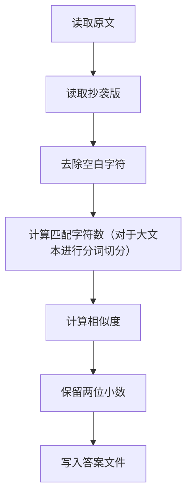

# 论文查重程序 程序设计文档

## 1.概述
- 1.**项目名称**： 论文查重
- 2.**语言**：python3
- 3.**运行方式**：
```bash
	python main.py <原文文件> <抄袭版文件> <结果文件>
```
- **目标**：给定原文文件和抄袭版论文文件，计算重复率，并将结果写入结果文件，保留两位小数
---


## 2. 需求分析

### 2.1 功能需求

- 1.从命令行读取三个参数：原文路径、抄袭版路径、答案输出路径
- 2.读取原文与抄袭文件内容
- 3.计算文件重复率
- 4.将重复率写入答案文件，保留两位小数
- 5.异常处理（空文件、路径不存在等）

### 2.2 其他需求

- 1.不能出现内存泄漏严重
- 2.五秒内未给出答案
- 3.占用的内存超过2048MB
- 4.不能发生异常退出
- 5.尝试连接网络、尝试读写其他文件或影响使用
- 6.代码的可读性（注释），变量、函数、类命名的规范化
---

## 3. 总体设计分析

### 3.1 模块划分

```text
计算模块
├── 文件读取
├── 文本预处理
├── 相似度计算
└── 结果输出
```


### 3.2 核心函数

| 函数名 | 所在文件 | 功能 | 输入 | 输出 |
|---|---|---|---|---|
| `read_file(path)` | `src/plagiarism.py` | 读取文件内容 | 文件路径 | 文本字符串 |
| `normalize_text(text)` | `src/plagiarism.py` | 去除空白字符 | 原始文本 | 规范化文本 |
| `calc_similarity(orig, plag)` | `src/plagiarism.py` | 计算相似度 | 两段文本 | 浮点数0.00~1.00  |
| `main()` | `main.py` | 调用计算模块 | 无 | 无 |

---

## 4. 核心算法

### 4.1 算法选择

本程序使用 Python 标准库 `difflib.SequenceMatcher` 计算相似度
对于大文本（超过5w字符）采用 n-gram + Jaccard 进行优化

`SequenceMatcher` 相似度公式：

```text
similarity = 2 * M / (len(orig) + len(plag))
```

其中：

- `M`：两段文本匹配的字符数；
- `len(orig)`：原文长度；
- `len(plag)`：抄袭版长度。

n-gram 就是连续的 n 个字符，以 n = 4 为例，对文本`今天天气很好`切分：
```text
今天天气
天天气很
天气很好
```
每个片段就是一个 4-gram。
把所有 4-gram 收集起来，放进一个集合（自动去重）

 `Jaccard` 算法相似度公式：
```text
J(A, B) = |A ∩ B| / |A ∪ B|
```
其中：

- `A ∩ B` ：两个集合共有的碎片数量；

- `A ∪ B`：两个集合合并后一共有多少种不同碎片；

- 结果范围是 0 到 1。

### 4.2 算法流程

